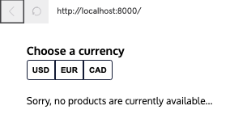
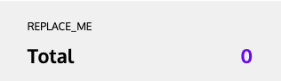

# CC Store project

### The first step towards completing the cart feature will be to define the actions that can change the state.cart slice, and to handle them in the reducer. Open up cartSlice.js where you will find the addItem() action creator as well as the reducer cartReducer() which can already handle a 'cart/addItem' action. In addition to adding items to the cart, the user should be able to modify the quantity of each item in their cart. First, you will need to create an action creator for this kind of action object.

Below the addItem() function:

##### Note: cartSlice.js,
1a. Declare a new function called changeItemQuantity
```javascript
const changeItemQuantity = () => {

}
```
1b. It should have two parameters: name (a string) and newQuantity (a number)
```javascript
const changeItemQuantity = (name, newQuantity) => {

}
```
1c. It should return an object with two properties: type and payload
```javascript
const changeItemQuantity = (name, newQuantity) => {
  return {
    type: 'cart/changeItemQuantity',
    payload: 'I DONT KNOW WHAT TO PUT HERE'
  }
}
```
1d. The payload should be an object with a .name and .newQuantity property.
```javascript
const changeItemQuantity = (name, newQuantity) => {
  return {
    type: 'cart/changeItemQuantity',
    payload: { name, newQuantity }
  }
}
```
1e. Export this function.
```javascript
export const changeItemQuantity = (name, newQuantity) => {
  ...
};
```

```javascript
// Example cart state
cart = {
  'Hat': { price: 15.99, quantity: 0 },
  'T-Shirt': { price: 15.99, quantity: 2 },
  'Hoodie': { price: 18.99, quantity: 1 },
},
```

### Great! Now that you know what changeItemQuantity() actions will look like, you can handle them in the cartReducer(). A case for this action type has already been started for you. It first pulls out the name and newQuantity from the payload and grabs the itemToUpdate from the cart.

The first step is to update this item — but you must do it immutably! Below the variable itemToUpdate…

##### cartSlice.js
2a. Declare a new variable called updatedItem and assign to it a new object.
```javascript
const updatedItem = {};
```

2b. Copy the contents of itemToUpdate into updatedItem but set the quantity property to the value of newQuantity.

```javascript
const updatedItem = {
  ...itemToUpdate,
  quantity: newQuantity,
}
```

3a. The final step is to return the new cart state with updatedItem included.
##### Note: in cartSlice.js, reference case for 'cart/addItem' return object. Follow that pattern.
```javascript
return {
  ...cart,
  [name]: updatedItem
}
```
4a. With the reducers and action creators ready to go, it’s time to set up the store.

Open up store.js and, at the top of the file, import the two functions from the 'redux' package used to create the store object: createStore and combineReducers.
##### Note, in store.js file, at the top, import as follows:
```javascript
import { createStore, combineReducers } from 'redux';
```

5a. Add three import statements to store.js, one for each of the slice reducers:
  inventoryReducer
  cartReducer
  currencyFilterReducer

```javascript
import { inventoryReducer } from '../features/inventory/inventorySlice.js';
import { cartReducer } from '../features/cart/cartSlice.js';
import { currencyFilterReducer } from '../features/currencyFilter/currencyFilterSlice.js';
```

### Now that you have imported all of the resources, you can combine the various slice reducers into a rootReducer using the combineReducers method. Then that rootReducer can be used to create the store object.

6a. First, call combineReducers() with an object as the argument.
```javascript
combineReducers({})
```

6b. The object passed to combineReducers() should pair each slice name with the appropriate slice reducer
##### Note: https://redux.js.org/api/combinereducers  Check documentation for how reducers are used. My google search was: combinereducers redux. My three keys are inventory, cart, and currentFilter
```javascript
combineReducers({
  inventory: inventoryReducer,
  cart: cartReducer,
  currentFilter: currencyFilterReducer,
})
```
6c. Next, pass the entire combineReducers({...}) function call as an argument to createStore().
```javascript
createStore(combineReducers({
  inventory: inventoryReducer,
  cart: cartReducer,
  currentFilter: currencyFilterReducer,
}))
```
6d. Finally, assign the returned value from createStore() to a new variable called store.
```javascript
const store = createStore(combineReducers({
  inventory: inventoryReducer,
  cart: cartReducer,
  currentFilter: currencyFilterReducer,
}));
```
6e. 
```javascript
export const store = createStore(combineReducers({
  inventory: inventoryReducer,
  cart: cartReducer,
  currentFilter: currencyFilterReducer,
}));
```

7a. At the top of the file, import the store from store.js.
##### Note: in the index.js file, import store.js
```javascript
import { store } from './app/store.js'
```
8a. Pass the current state of the store as a prop called state to the <App /> component
```javascript
<App 
  state={store.getState()}
/>
```
8b. Pass the store.dispatch method as a prop called dispatch to the <App /> component
```javascript
  <App 
    state={state.getState()}
    dispatch={store.dispatch}
  />
```

8c. Run your program and you should see the currency buttons rendered at the top of the screen and the text “Sorry, no products are currently available…”.



### The products are not being rendered yet because the product data is only fetched AFTER the page first loads. If you take a look at src/features/inventory/Inventory.js you will see that this component dispatches a loadData() action upon mounting. 

### You need to make sure that when any state changes occur, the components are re-rendered with the most up-to-date data.

9a. At the bottom of index.js subscribe the render function to changes to the state of the store.
```javascript
store.subscribe(render)
```
##### Note: Checkpoint... Run your program and you should see the full inventory rendered to the screen!

## Render the Cart component with data from the store.

### Open up App.js and you can see that the <CurrencyFilter /> and <Inventory /> presentational components are being rendered with their slice of state data and the dispatch method, but the <Cart /> component is missing!

10a. At the top of App.js, import the Cart component from Cart.js.
```javascript
import { cart } from '../features/cart/Cart.js';
```

### Now, let’s add the <Cart /> into the <App /> component’s structure. Like the other two components, the <Cart /> will need access to its slice of state and the dispatch method. It will also need access to the currencyFilter slice of state to calculate the total cart price.

##### Note: Inside the App() component’s return statement (in App.js)… 

11a. Add in the <Cart /> component below the <Inventory /> component.
```javascript
<Cart />
```
##### Reference the components properties above for how to implement cart's prop value.
11b. The <Cart /> component should have three prop values: cart, currencyFilter, and dispatch.
```javascript
<Cart
  cart={state.cart}
  currentFilter={state.currencyFilter}
  dispatch={dispatch}
/>
```
Checkpoint 2


## Use store data in the Cart component.

### Open up Cart.js and take a look at the return statement. Notice that it is trying to render the variable cartElements, which is currently holding the string 'REPLACE_ME'.

### Instead, cartElements should be an array of <li> elements created using the createCartItem() helper function defined at the bottom of the file.

### Recall that the cart slice of state is an object where each key is the name of an item in the cart. Do the following to make the desired cartElements array:

##### Note: In Cart.js:
12a. Initialize cartElements to an empty array. Replace const cartElements = 'REPLACE_ME' with the following:
```javascript
const cartElements = [];
```
12b. Iterate through the keys of the cart object
A helpful link for step 12's interating and mapping through the cart object: [Javascript Iterate Link](https://attacomsian.com/blog/javascript-iterate-objects)
```javascript
let keys = Object.keys(cart);
```
12c. For each key, which is the name of an item, call createCartItem() with that item name as an argument.
```javascript
keys.forEach((key, index) => {
  createCartItem(key)
})
```
12d. Store the values returned by createCartItem() in cartElements.
```javascript
keys.forEach((key, index) => {
  cartElements.push(createCartItem(key));
})
```

### Try adding items to your cart. They now show up! However, there are a few things wrong. Most obviously, the cart total is not showing up properly.

### At the top of the Cart.js file, the calculateTotal helper function is imported from the src/utilities/utilities.js file. As the name suggests, you can use this function to calculate the cart’s total!

13a. Call calculateTotal() with the cart and currencyFilter prop values as arguments and store the result in the variable total.
Note: Change const total = 0 to let total = 0;
```javascript
let total = 0;
total = calculateTotal(cart, currencyFilter);
// a second option would be to just overwrite const total = 0 with the following:
const total = calculateTotal(cart, currencyFilter);

```
14a. At the top of Cart.js, import the changeItemQuantity() action creator that you made earlier in this project.
```javascript
import { changeItemQuantity } from './cartSlice.js';
```
15a. At the end of onInputChangeHandler()… Use the dispatch method from the props to dispatch a changeItemQuantity() action with name as the first argument and newQuantity as the second.

##### Note: Because the dispatch redux documentation was not helpful for me (in this instance), I created a local copy of this project onto my computer. Then I used VS CODE's search feature and typed in "dispatch". I checked all the different implementations of dispatch and decided on the CurrencyFilter.js implementation as the format that I want to use. Inventory.js and SearchTerm.js also have similar implementations of the dispatch function they are asking for here.
```javascript
dispatch(changeItemQuantity(name, newQuantity));
```

### Add a search feature (like in the Recipes app) to filter the products shown in the inventory.

### The src/features/searchTerm/ directory has already been created for you with a completed SearchTerm.js component file. 

16a. Complete searchTermSlice.js by creating and exporting the slice reducer and action creators. Note: Open the hints tab for the steps of implementation.

16a. Create a function called searchTermReducer that can handle the following action types:
  16a1. * 'searchTerm/setSearchTerm'
  16a2. * 'searchTerm/clearSearchTerm'
  16a3. * Don't forget to set the initial state and return state by default!
Note: The initial state of the search term should be an empty string.
```javascript
let initialState = "";
export const searchTermReducer = ( state=initialState, action) => {
  switch (action.type) {
    case 'searchTerm/setSearchTerm': {
      return action.payload
    }
    case 'searchTerm/clearSearchTerm': {
      return "";
    }
    default: {
      return initialState = ""
    }
  }
};
```
16a. Create a function called setSearchTerm
  16a4. It has one parameter, term
  16a5. It returns an action object whose payload is the term value
  16a6. See SearchTerm.js for how this will be used. Note: searchTerm and dispatch
```javascript
export const setSearchTerm = (term) => {
  return {
    type: 'searchTerm/setSearchTerm',
    payload: term
  }
}
```
16a. Create a function called clearSearchTerm
  16a7. It returns an action object with no payload
  16a8. See SearchTerm.js for how this will be used.
```javascript
export const clearSearchTerm = () => {
  return {
    type: 'searchTerm/clearSearchTerm'
  }
}
```
16b. Add the slice reducer to the rootReducer for the store.
Note: in store.js, import searchTermReducer from searchTermSlice.js
```javascript
import { searchTermReducer } from '../features/searchTerm/searchTermSlice.js';
export const store = createStore(combineReducers({
  ...,
  searchTerm: searchTermReducer
}));
```

16c. Render the component in the <App /> with the appropriate data.
Note: Import searchTerm from searchTerm.js at the top of App.js. Also, where we place the <SearchTerm /> component is where it will render, so I put it after <Currency /> but before <Inventory />. 
```javascript
import { SearchTerm } from '../features/searchTerm/SearchTerm.js';
<Currency />
<SearchTerm
  searchTerm={state.searchTerm}
  dispatch={dispatch}
/>
<Inventory />
```
16d. To filter out the inventory values, you can use this function:
Note: Place the following getFilteredItems function inside of App.js at the bottom of the file.
```javascript
function getFilteredItems(items, searchTerm) {
  return items.filter(items => items.name.toLowerCase().includes(searchTerm.toLowerCase()));
}
```
16e. The search term now works, but the inventory of items is not filtered out when using our SearchTerm component. Now, in our <Inventory /> component, replace the state.inventory with a call to getFilteredItems
```javascript
// Implement the function below into the Inventory component. 
<Inventory
  inventory={getFilteredItems(items, searchTerm)}
  ...
  ...
/>
```
16f. For the inputs, in the getFilteredItems function, (in App.js Inventory component, ), consider what to match items and searchTerm with. The current state of items and the current state of searchTerm is what we are going for. 
```javascript
// Implement the function below into the Inventory component. 
<Inventory
  inventory={getFilteredItems(state.inventory, state.searchTerm)}
  ...
  ...
/>
```
Now check the SearchTerm with by filter out "tee" and we will see three t-shirts. 